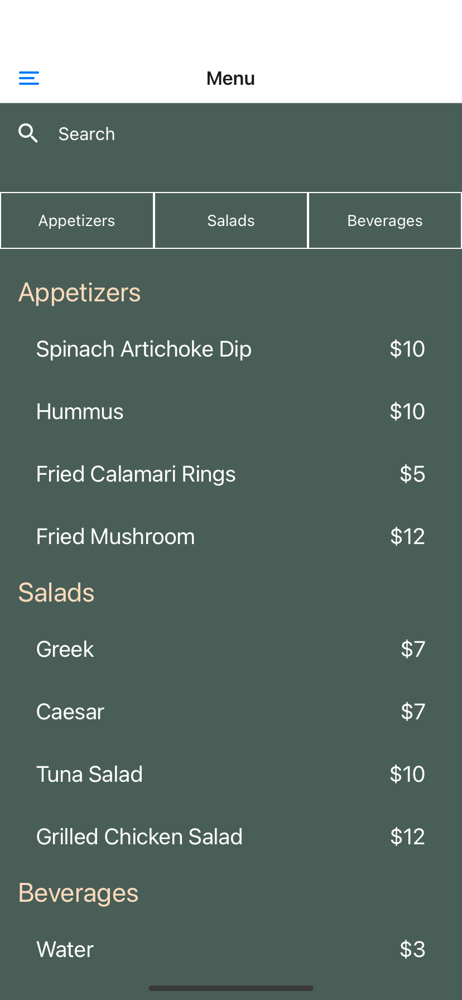
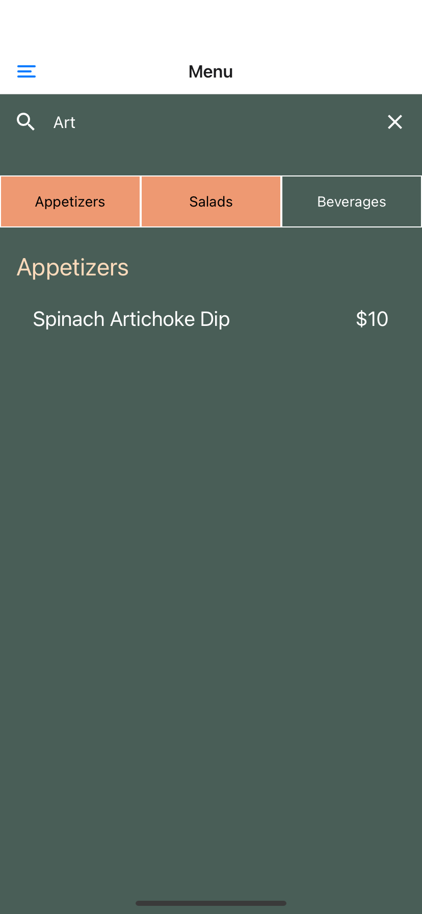
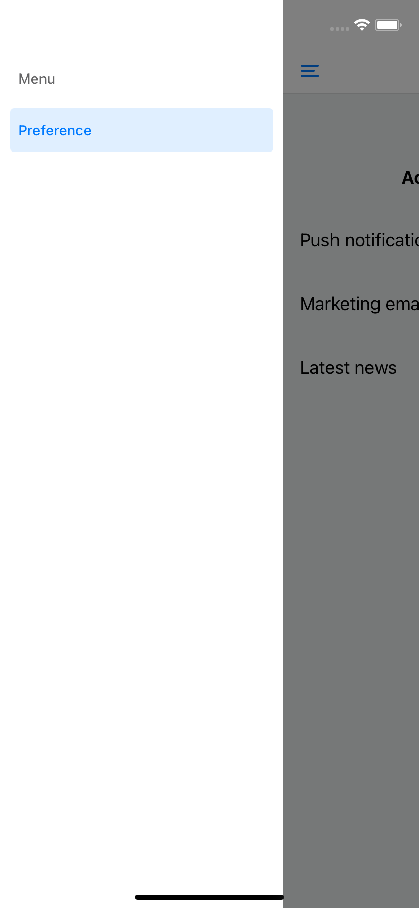
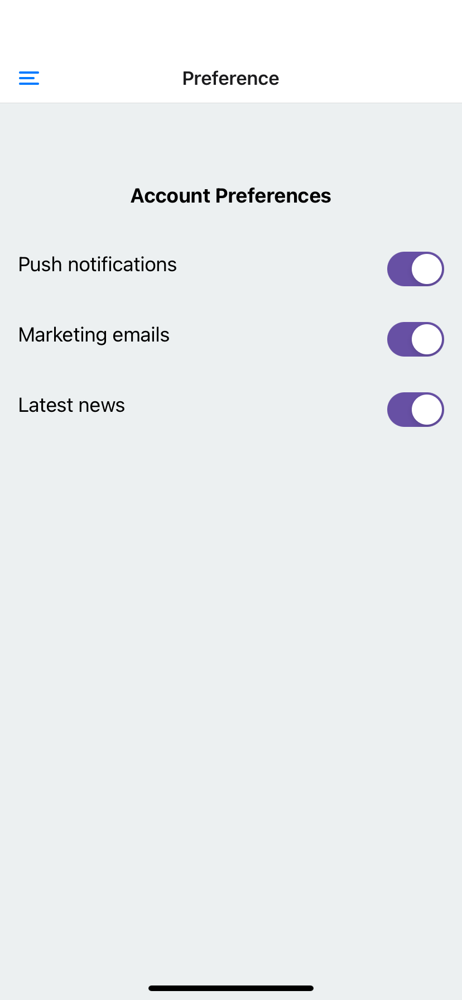

# React Native Mobile App Example

This mobile app serves as an illustration of how to create a React Native application using Expo. The app demonstrates making API calls, implementing data persistence with AsyncStorage, and utilizing SQLite for local database storage.

## Features

- **API Calls:** The app demonstrates how to make API calls to retrieve data from a server using Expo's networking features.

- **AsyncStorage:** AsyncStorage is employed for simple local data persistence. It showcases how to store and retrieve data locally on the device.

- **SQLite Database:** The app incorporates SQLite for more robust local data storage. It highlights how to create tables, execute SQL queries, and manage local data using Expo SQLite.

- **Search and Filtering:** The app provides a search and filtering feature to enhance the user experience. Users can perform searches based on a query string and filter results by selecting specific categories. The combination of these features allows for efficient data retrieval and enhances the user's ability to find relevant information.


## Technologies Used

- **React Native:** A JavaScript framework for building mobile applications.

- **Expo:** A framework and set of tools built on top of React Native that simplifies the development process.

- **AsyncStorage:** AsyncStorage is a simple, unencrypted, asynchronous, persistent, key-value storage system.

- **SQLite:** SQLite is a self-contained, serverless, and zero-configuration database engine.

## Getting Started

Follow these steps to set up and run the project locally:

1. **Clone the repository:**
   ```bash
   git clone https://github.com/your-username/your-repo.git
   ```

2. **Navigate to the project directory:**
   ```bash
   cd your-repo
   ```

3. **Install dependencies:**
   ```bash
   npm install
   ```

4. **Run the application:**
   ```bash
   npm start
   ```

5. **Follow Expo instructions to run on an emulator or physical device.**


## App Screenshots

<!-- | Home Screen | Settings Screen |
|-------------|------------------|
|  |  | -->

| Menu Display | Filtering |
|--------------|------------|
|  |  |

| Drawer Menu | Preferences |
|-------------|-------------|
|  |  |


## Configuration

The app may require additional configuration based on your specific use case. Look for configuration files or environment variables that may need adjustment.

## Inspired By

This project is inspired by the Coursera React Native Specialization.

## Contributing

Contributions are welcome! Feel free to open an issue or submit a pull request.

## License

This project is licensed under the [MIT License](LICENSE).
